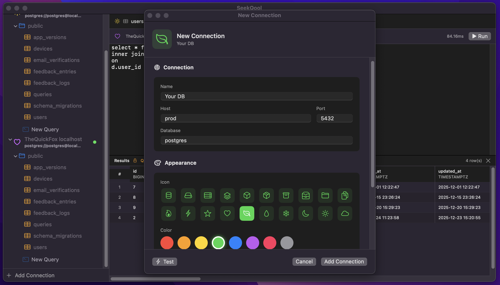
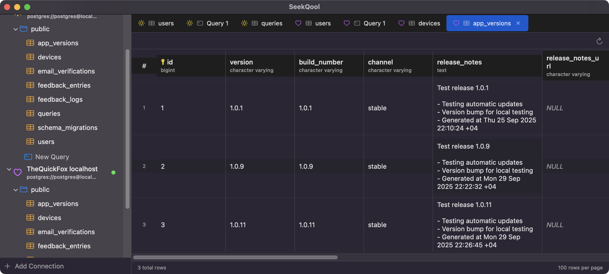
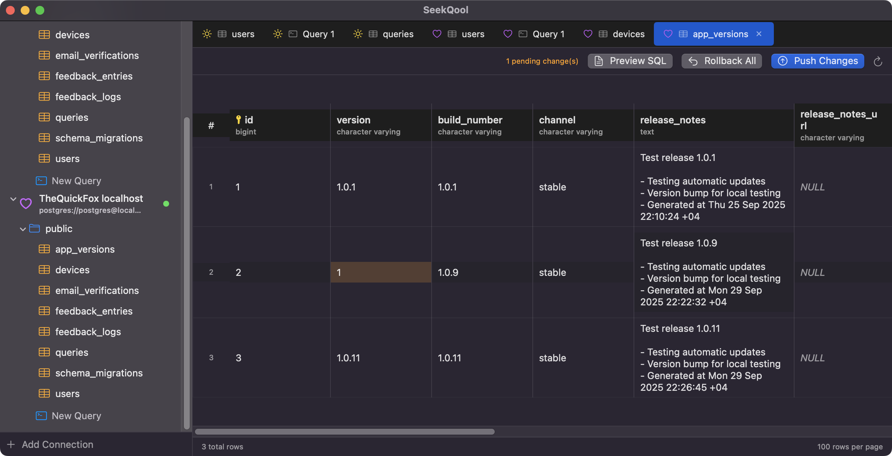
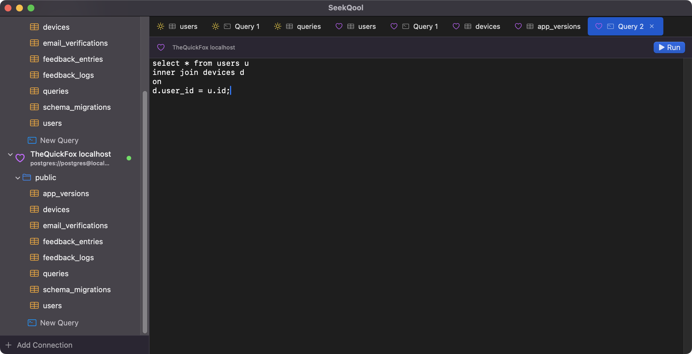
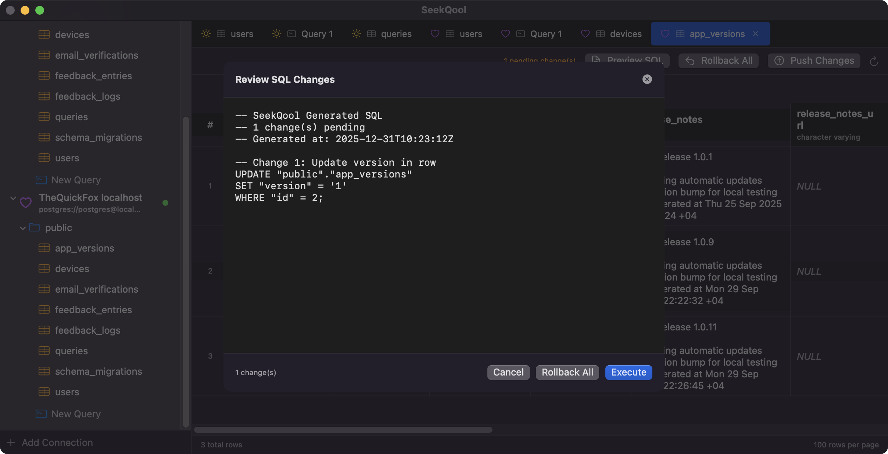

# SeekQool

**The PostgreSQL client that doesn't suck.**

A native macOS app for developers who want to browse, query, and edit their Postgres data without the bloat.



### See it in action

<div style="padding:62.5% 0 0 0;position:relative;"><iframe src="https://player.vimeo.com/video/1150826039?badge=0&amp;autopause=0&amp;player_id=0&amp;app_id=58479" frameborder="0" allow="autoplay; fullscreen; picture-in-picture; clipboard-write; encrypted-media; web-share" referrerpolicy="strict-origin-when-cross-origin" style="position:absolute;top:0;left:0;width:100%;height:100%;" title="How SeekQool works"></iframe></div><script src="https://player.vimeo.com/api/player.js"></script>

---

## Why SeekQool?

You've tried them all. Electron apps that eat 2GB of RAM. Java tools from 2008. Web UIs that feel like swimming through molasses.

SeekQool is different:

- **Native macOS** — Built with SwiftUI. Launches instantly. Uses ~50MB of memory.
- **Edit inline** — Double-click any cell. Change it. Preview the SQL. Push.
- **Smart queries** — Write `SELECT email FROM users` and still edit the results. We handle the primary keys.
- **Stay connected** — Laptop sleep? Network blip? SeekQool reconnects automatically.
- **Remember everything** — Your tabs, queries, and sort orders persist across sessions.

---

## Features

### Browse Tables

Click a table. See the data. Sort by any column. Paginate through millions of rows.



### Edit Anything

Double-click a cell to edit. Right-click to set NULL. See exactly what SQL will run before you commit.



### Query Editor

Write raw SQL. Get results. Edit them too (for simple SELECTs).



### SQL Preview

Never push blind. Review every UPDATE statement before it hits your database.



---

## Installation

### Build & Install

```bash
git clone https://github.com/foxwise-ai/seekqool.git
cd seekqool/macOS
./scripts/build.sh
./scripts/install.sh
```

App installs to `~/Applications/SeekQool.app`.

### Manual Build

```bash
cd seekqool/macOS
swift build -c release
```

Binary lands in `.build/release/SeekQool`.

### Xcode

```bash
cd seekqool/macOS
open Package.swift
```

Then **Product → Archive** for a distributable `.app`.

---

## Quick Start

1. Launch SeekQool
2. Click **+** to add a connection
3. Enter your Postgres credentials
4. Double-click a table to browse
5. Double-click a cell to edit

That's it. No setup wizards. No configuration files. No bullshit.

---

## Requirements

- macOS 14.0+
- PostgreSQL 12+ (any standard Postgres-compatible database)

---

## Keyboard Shortcuts

| Action | Shortcut |
|--------|----------|
| Run Query | `⌘ + Return` |
| New Query Tab | `⌘ + T` |
| Close Tab | `⌘ + W` |
| Refresh | `⌘ + R` |

---

## Roadmap

- [ ] Multiple result sets
- [ ] Export to CSV/JSON
- [ ] Table structure editor
- [ ] Dark mode refinements
- [ ] SSH tunneling

---

## Built With

- **SwiftUI** — Native macOS UI
- **PostgresNIO** — Async PostgreSQL driver
- **Swift Concurrency** — Modern async/await

---

## License

MIT

---

## Contributing

Found a bug? Want a feature? Open an issue or submit a PR.

---

<p align="center">
  <strong>Stop fighting your database tools. Start shipping.</strong>
</p>
